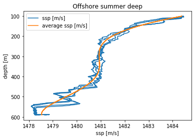

# CTD-project1

Joshua Mundt;
CTD project 1;
1/31/2020

Link:  https://github.com/joshuamundt/CTD-project1.git

  For this project, I obtained the ocean data from OOI website. For each location, I procured data from deep and shallow profiler for both winter and summer on the same day. For the majority,  I selected Jan 6-7, 2019 for winter and July 6-7, 2019 for summer, but since all of the profilers don’t have data on similar day, I had to pick a different date or month. The Oregon Shelf Surface Piercing Profiler Mooring doesn’t have enough data so I did not include it in this project. 
There were six or nine dives in a span of 24 hours in the winter and summer when the CTD device traveled shallow depth. However, when the CTD device traveled deeper, as illustrated in the figures below, the number of dives went down to 2 dives in both winter and summer.

The data explicitly shows that the number of dives per day was considerably lower when the device travels deeper, regardless of seasons. According to the data, the maximum speed of the sound was 1512m/s and 1507m/s in the summer and winter respectively. The maximum speed of sound profile was slightly higher in the summer because the temperature of the water increases and aids the sound wave vibration to transfer faster in the water molecules. The Images below depict the maximum speed of sound in relation to the depth of seawater.

It is apparent that the speed of sound in the ocean is faster near the surface for both summer and winter.
According to given date, a huge discrepancy in speed of sound is not shown between day and night. After comparing the ssp profile in day and night of all profilers, most of the data has similar speed of sound for both day and night time, but a location, such as offshore has higher speed of sound during the day, especially in the morning.

For example, the image above shows that the speed of sound is faster early in the morning and afternoon. The reason could be that, during the day time, the speed of the sound profile in all profilers increased because the temperature is higher at day time, which enables the sound wave to travel faster.

The ssp profiles in the summer has slightly higher thermocline compared to winter profiles, and the thermocline in the summer is closer to the surface as it the images indicate below.

The plots show that the offshore summer has considerably higher thermocline compared to the thermocline in the winter, and it is closer to the surface.

It is quite difficult to compare the average ssp profiles of all profilers recorded at the same day in winter and summer because the OOI website wasn’t able to provide all data on the same day. Therefore, for some data, I had to select a different date or month in the winter and summer. Regardless of  the exact date in the summer or winter, the difference in location didn’t play a major role in changing the average ssp profile. As mentioned above, the season affects the ssp profile noticeably. The images below indicate that in summer, the thermocline is higher and sited near the surface, and the speed of sound is faster.

